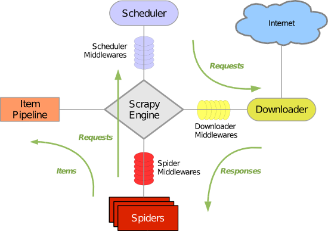

# scrapy

Scrapy是一个为了爬取网站数据，提取结构性数据而编写的应用框架。 可以应用在包括数据挖掘，信息处理或存储历史数据等一系列的程序中。  
所谓网络爬虫，就是一个在网上到处或定向抓取数据的程序，当然，这种说法不够专业，更专业的描述就是，抓取特定网站网页的HTML数据。抓取网页的一般方法是，定义一个入口页面，然后一般一个页面会有其他页面的URL，于是从当前页面获取到这些URL加入到爬虫的抓取队列中，然后进入到新页面后再递归的进行上述的操作，其实说来就跟深度遍历或广度遍历一样。  
Scrapy 使用 Twisted这个异步网络库来处理网络通讯，架构清晰，并且包含了各种中间件接口，可以灵活的完成各种需求。

## 整体架构

> * 引擎\(Scrapy Engine\)，用来处理整个系统的数据流处理，触发事务。
> * 调度器\(Scheduler\)，用来接受引擎发过来的请求，压入队列中，并在引擎再次请求的时候返回。
> * 下载器\(Downloader\)，用于下载网页内容，并将网页内容返回给蜘蛛。
> * 蜘蛛\(Spiders\)，蜘蛛是主要干活的，用它来制订特定域名或网页的解析规则。编写用于分析response并提取item\(即获取到的item\)或额外跟进的URL的类。 每个spider负责处理一个特定\(或一些\)网站。
> * 项目管道\(Item Pipeline\)，负责处理有蜘蛛从网页中抽取的项目，他的主要任务是清晰、验证和存储数据。当页面被蜘蛛解析后，将被发送到项目管道，并经过几个特定的次序处理数据。
> * 下载器中间件\(Downloader Middlewares\)，位于Scrapy引擎和下载器之间的钩子框架，主要是处理Scrapy引擎与下载器之间的请求及响应。
> * 蜘蛛中间件\(Spider Middlewares\)，介于Scrapy引擎和蜘蛛之间的钩子框架，主要工作是处理蜘蛛的响应输入和请求输出。
> * 调度中间件\(Scheduler Middlewares\)，介于Scrapy引擎和调度之间的中间件，从Scrapy引擎发送到调度的请求和响应。

### 爬取流程

上图绿线是数据流向，首先从初始URL开始，Scheduler会将其交给Downloader进行下载，下载之后会交给Spider进行分析，Spider分析出来的结果有两种：一种是需要进一步抓取的链接，例如之前分析的“下一页”的链接，这些东西会被传回Scheduler；另一种是需要保存的数据，它们则被送到Item Pipeline那里，那是对数据进行后期处理（详细分析、过滤、存储等）的地方。另外，在数据流动的通道里还可以安装各种中间件，进行必要的处理。

### 数据流

Scrapy中的数据流由执行引擎控制，其过程如下:

> 1. 引擎打开一个网站\(open a domain\)，找到处理该网站的Spider并向该spider请求第一个要爬取的URL\(s\)。
> 2. 引擎从Spider中获取到第一个要爬取的URL并在调度器\(Scheduler\)以Request调度。
> 3. 引擎向调度器请求下一个要爬取的URL。
> 4. 调度器返回下一个要爬取的URL给引擎，引擎将URL通过下载中间件\(请求\(request\)方向\)转发给下载器\(Downloader\)。
> 5. 一旦页面下载完毕，下载器生成一个该页面的Response，并将其通过下载中间件\(返回\(response\)方向\)发送给引擎。
> 6. 引擎从下载器中接收到Response并通过Spider中间件\(输入方向\)发送给Spider处理。
> 7. Spider处理Response并返回爬取到的Item及\(跟进的\)新的Request给引擎。
> 8. 引擎将\(Spider返回的\)爬取到的Item给Item Pipeline，将\(Spider返回的\)Request给调度器。
> 9. \(从第二步\)重复直到调度器中没有更多地request，引擎关闭该网站。

作者：JasonDing

链接：[http://www.jianshu.com/p/a8aad3bf4dc4](http://www.jianshu.com/p/a8aad3bf4dc4)

來源：简书

著作权归作者所有。商业转载请联系作者获得授权，非商业转载请注明出处。

